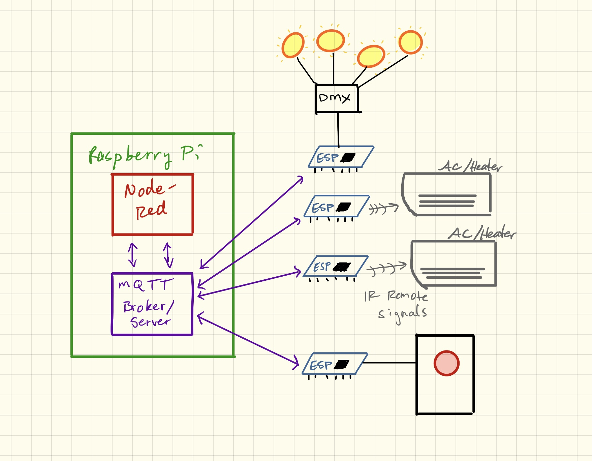

# Space Automation for NYC Resistor

## Quick Guide

**See the dashboard** and turn things on and off: 

go to [http://192.168.1.32:1880/ui](http://192.168.1.32:1880/ui) in your browser.  _This only works if you're in the space and on the NYCR24 wifi_.


**Edit the UI** to do different things or see how it works:

go to [http://192.168.1.32:1880](http://192.168.1.32:1880) in your browser.  _This only works if you're in the space and on the NYCR24 wifi_.


## Infrastructure and Maintenance



The brains of the system live on a Raspberry Pi behind the laser room door, connected to the monitor on the wall.  The monitor is displaying a Chromium tab in kiosk mode serving just the Node-RED UI.  It will open Chromium to this page automatically on reboot.

You can ssh into the pi, the password is in LastPass:

```
$ ssh pi@192.168.1.32
```

The display is built with [Node-RED](https://nodered.org), a flow-based language for passing messages between networked devices by every imaginable protocol. 

All the "Things" scattered around the space communicate with the Pi via [MQTT](http://mqtt.org).  There's an [MQTT Mosquitto Broker](https://mosquitto.org) (server) running on the Pi as a central hub for these messages.  There's a detailed section on MQTT below.

Node-RED listens for the messages and updates the UI, and it sends out control messages in response to button presses on the UI.

The flows in the pallette are all stored as a json file: `/home/pi/.node-red/flows_raspberrypi.json`.  A recent (hopefully the most recent) working copy is checked into this repo.

## Starting and Stopping the Services

Everything is set up to start up automatically when the Pi boots, so if things are borked it's always fine to just reboot the Pi.

The Mosquitto broker:
```
$ sudo mosquitto -c /etc/mosquitto/conf.d/mosquitto.conf
```

The Node-RED server _(Do NOT run these commands with sudo or it will run as root and everything will be wrong)_:

```
$ node-red-stop
$ node-red-start
```

These are the commands for enabling/disabling node-red startup on boot.  I've run the first one, so if there are problems, try disabling it:

```
$ sudo systemctl enable nodered.service
$ sudo systemctl disable nodered.service
```

## Regular Maintenance

Updating the pi:

```
$ sudo apt-get update
$ sudo apt-get upgrade
```

Updating node-red:

```
$ bash <(curl -sL https://raw.githubusercontent.com/node-red/raspbian-deb-package/master/resources/update-nodejs-and-nodered)
```

## Mosquitto/MQTT

The pi's mosquitto server can be reached at `192.168.1.32:1883`.

To look at all the messages being published to the broker run:

```
mosquitto_sub -v -t "#"
```
