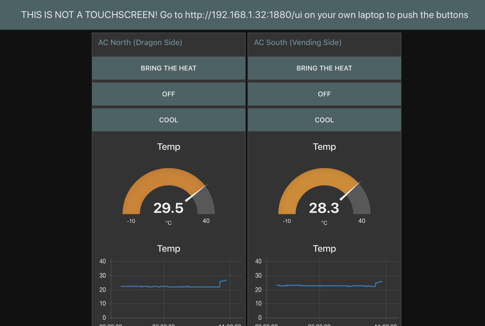
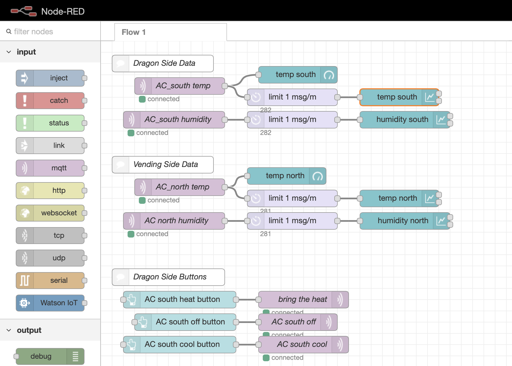
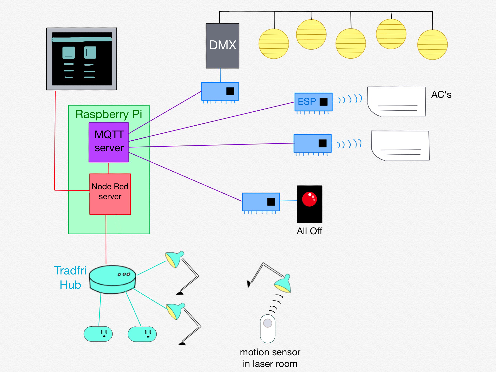

# Space Automation for NYC Resistor

## Usage

Scan the QR code on the dashboard screen (by the laser room) to get the dashboard on your phone so you can push the buttons.  You can also go to the url shown on the screen:

[http://192.168.1.32:1880/ui](http://192.168.1.32:1880/ui) _This only works if you're in the space and on the NYCR24 wifi_.



## Hack it! 

The beating heart of the system is a [Node Red](https://nodered.org) server running on a Raspberry Pi in the laser room.  Node Red is a flow-based programming environment that makes it easy to tell networked things how to interact with each other.  

The flows can be viewed in a browser.  This is important:  **there is currently no real version control, and there is no undo**.  Whenever I make changes I copy the flow file from the Pi to this repo and push the changes.  If you mess things up, you can grab the last known good file from here.  I would highly recommend you make a habit of saving copies of the flow file as you work until we figure out a versioning system for this.  Also, simultaneous editing will probably cause chaos since there is only the one view, lol, have fun with that.  To see and edit the flows just strip the `ui` part off the url:

[http://192.168.1.32:1880](http://192.168.1.32:1880) _This only works if you're in the space and on the NYCR24 wifi_.



## Infrastructure and Maintenance



Except for the motion sensor-controlled lights (in the laser room and restroom), everything connects back to the Node Red server running on the Pi.  

The newest members of the family are an [Ikea Tradfri](https://www.ikea.com/us/en/catalog/categories/departments/lighting/36812/) hub and its four children:  two smart plugs and the bulbs in two desk lamps (at the soldering station and the craft table).

The round lantern lights hanging from the ceiling are all connected to a DMX controller, which is being controlled by an ESP microcontroller board.  The ESP talks [MQTT](http://mqtt.org) back to Node Red, and receives commands from Node Red also via MQTT.

The same goes for the two ESP boards associated with the AC units.  They send IR signal to the AC units' remote receivers, and communicate via MQTT back to Node Red.  The All Off button by the door is also controlled by an ESP board via MQTT.

There's a screen displaying the Node Red dashboard on the wall by the laser room.  It's plugged directly into the Pi, and it's running the dashboard in a Chromium tab in kiosk mode.  If the Pi is rebooted the Node Red and MQTT servers come back up automatically, and the monitor will automatically show the dashboard.

You can ssh into the pi, the password is in LastPass:

```
$ ssh pi@192.168.1.32
```

To make changes to the system you'll want to get familiar with [Node-RED](https://nodered.org) and [MQTT](http://mqtt.org).  There's an [MQTT Mosquitto Broker](https://mosquitto.org) (server) running on the Pi as a central hub for these messages.  There's a detailed section on MQTT below.

Node-RED listens for the messages and updates the UI, and it sends out control messages in response to button presses on the UI.

The flows in the pallette are all stored as a json file: `/home/pi/.node-red/flows_raspberrypi.json`.  A recent (hopefully the most recent) working copy is checked into this repo.

## Starting and Stopping the Services

Everything is set up to start up automatically when the Pi boots, so if things are borked it's always fine to just reboot the Pi.

The Mosquitto broker:
```
$ sudo mosquitto -c /etc/mosquitto/conf.d/mosquitto.conf
```

The Node-RED server _(Do NOT run these commands with sudo or it will run as root and everything will be wrong)_:

```
$ node-red-stop
$ node-red-start
```

These are the commands for enabling/disabling node-red startup on boot.  I've run the first one, so if there are problems, try disabling it:

```
$ sudo systemctl enable nodered.service
$ sudo systemctl disable nodered.service
```

## Regular Maintenance

Updating the pi:

```
$ sudo apt-get update
$ sudo apt-get upgrade
```

Updating node-red:

```
$ bash <(curl -sL https://raw.githubusercontent.com/node-red/raspbian-deb-package/master/resources/update-nodejs-and-nodered)
```

## Mosquitto/MQTT

The pi's mosquitto server can be reached at `192.168.1.32:1883`.

To look at all the messages being published to the broker run:

```
mosquitto_sub -v -t "#"
```

## Wish List

- a Hackers button
- an "All On" panel that has buttons for:
	- all lights on
	- heat
	- cool
- integrate the back room into the "All Off" button system so it can really be an "All Off" button
- temperature sensors located where people actually sit in the space
- announcements!
